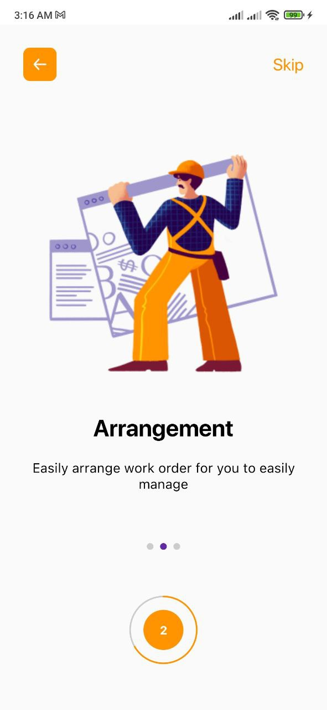
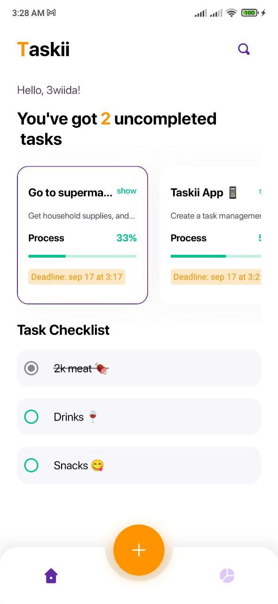
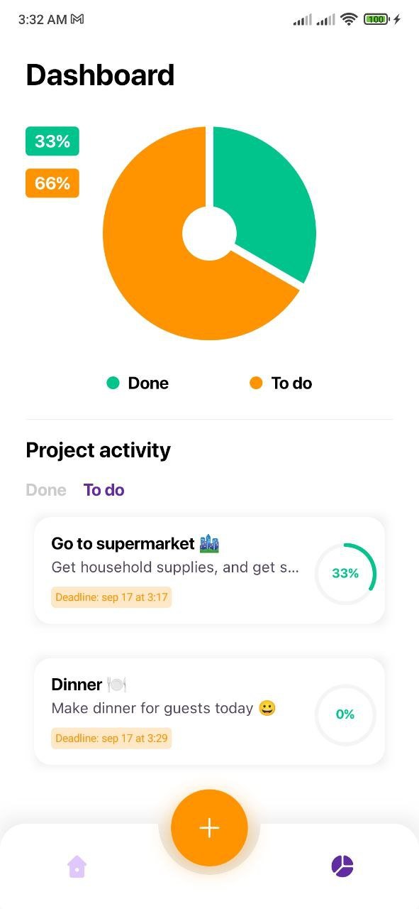
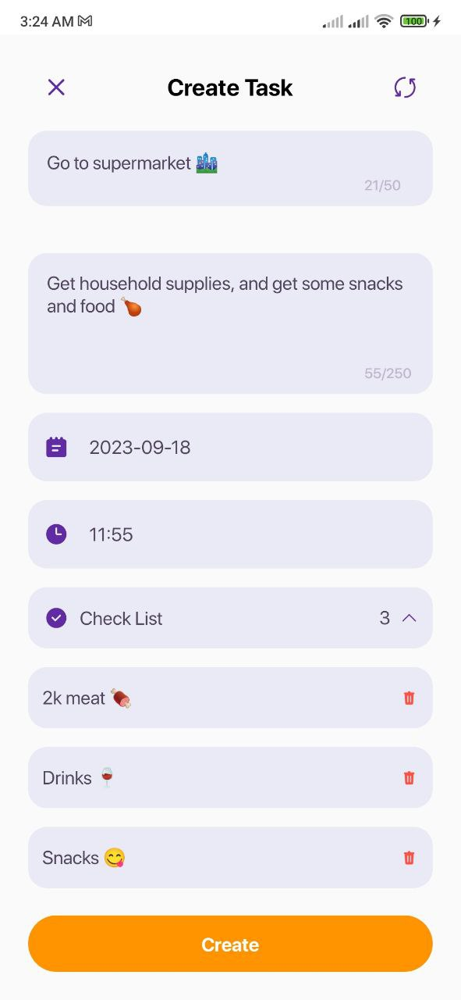
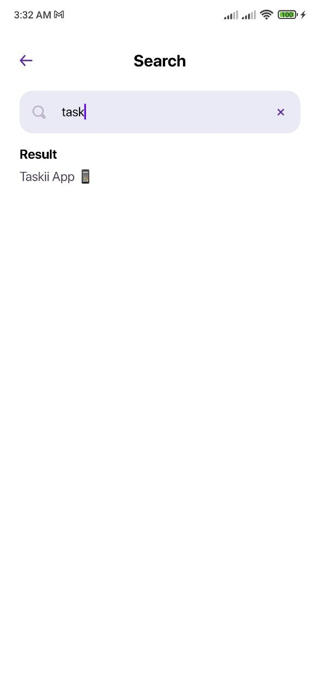

# Taskii 1.0

Taskii is a modern, slick, open-source Android task management app.

Available on MediaFire Store and soon also on Google Play.

## Screenshots

   
   
   
   
  

## 📚 Android tech stack

One of the main goals of Taskii is to use all the latest libraries and tools available.

### 🧑🏻‍💻 Android development

- Application is entirely written in [Kotlin](https://kotlinlang.org)
- Complete migrated to [Jetpack Compose](https://developer.android.com/jetpack/compose)
- Following the [Material You](https://m3.material.io/) guidelines and dynamic color
- Asynchronous processing using [Coroutines](https://kotlin.github.io/kotlinx.coroutines/)
- Dependency injection with [Hilt](https://dagger.dev/hilt/)
- Database using [Room](https://developer.android.com/topic/libraries/architecture/room)
- Architectural pattern using [MVVM](https://en.wikipedia.org/wiki/Model%E2%80%93view%E2%80%93viewmodel)
- Data Persistence by [DataStore](https://developer.android.com/topic/libraries/architecture/datastore)
- Custom shapes using [Canvas](https://developer.android.com/reference/android/graphics/Canvas)

### Features ✨

- Create task
- Add a deadline for the task
- Subtasks for a single task
- Search for a specific task
- Monitor single-task progress
- Get the results of your progress in all tasks via the analytics screen
- Real-time update
- Remove task from the database
  

### Upcoming features 🕓

- Edit task
- Send notification to the user when the deadline of any task is close
- Add assets to task
- Get tasks on a specific day of the month
- Add members to the task (People who will help in the task)

## Find this repository useful? :heart:
Support it by putting a star for this repository. :star:  
Also, __[follow me](https://github.com/3wiida)__ on GitHub for my next creations! 🤩
